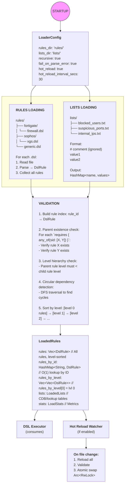
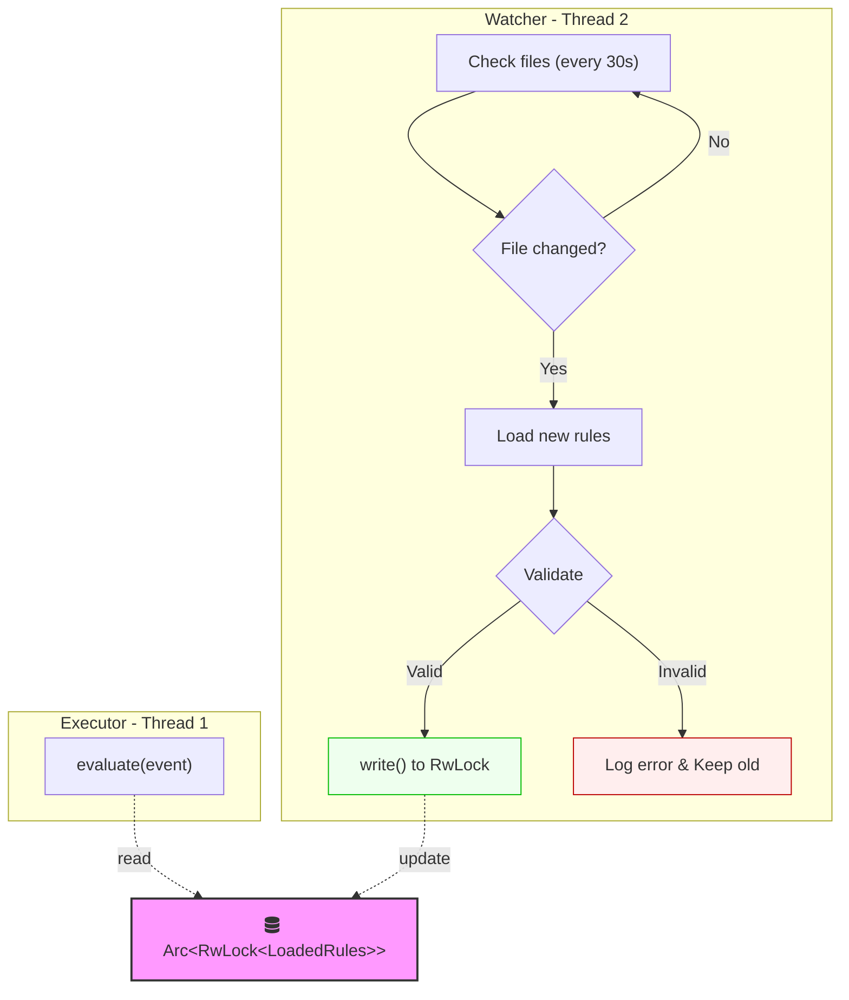

# DSL Loader V2 - Technical Design Document

## **Overview**

The DSL Loader V2 is responsible for loading, parsing, validating, and organizing SIEM detection rules from .dsl files and lookup lists from .txt files. It serves as the bridge between raw rule files on disk and the DSL Executor V2 that evaluates events at runtime.

---

## **Design Goals**

1. **Zero-downtime rule updates** - Hot reload without restarting the engine
2. **O(1) rule lookup** - Pre-indexed by ID and level
3. **Rich validation** - Catch errors at load time, not runtime
4. **List/CDB support** - External lookup tables for dynamic matching
5. **Production-ready** - Proper error handling, logging, metrics

---

## **Configuration**

| Field | Type | Default | Env Variable | Description |
| --- | --- | --- | --- | --- |
| rules_dir | PathBuf | "rules/" | DSL_RULES_DIR | Directory containing .dsl files |
| lists_dir | PathBuf | "lists/" | DSL_LISTS_DIR | Directory containing .txt lookup files |
| recursive | bool | true | - | Scan subdirectories for rules |
| fail_on_parse_error | bool | true | - | Stop on first error vs collect all |
| hot_reload | bool | false | DSL_HOT_RELOAD | Watch directories for changes |
| hot_reload_interval_secs | u64 | 30 | DSL_HOT_RELOAD_INTERVAL | How often to check for changes |

---

## **Architecture**

---

## **Data Structures**

**LoadedLists**

Holds all lookup tables loaded from the lists/ directory.

| Field | Type | Purpose |
| --- | --- | --- |
| lists | HashMap<String, HashSet<String>> | String lookups (users, domains) |
| ip_lists | HashMap<String, Vec<IpNetwork>> | IP/CIDR lookups with network matching |
| port_lists | HashMap<String, HashSet<u16>> | Port number lookups |

**List file naming convention:**

- Filename without extension becomes the list name
- blocked_users.txt → list name is blocked_users
- Rules reference as: field["user"] IN list("blocked_users")

**LoadedRules**

Complete output structure ready for the executor.

| Field | Type | Purpose |
| --- | --- | --- |
| rules | Vec<DslRule> | All rules, sorted by level |
| rules_by_id | HashMap<String, DslRule> | For requires/parent lookup |
| rules_by_level | Vec<Vec<DslRule>> | Index 0 = level 0 rules, etc. |
| lists | LoadedLists | All lookup tables |
| stats | LoadStats | Load metrics |

**LoadStats**

Metrics collected during loading.

| Field | Type | Purpose |
| --- | --- | --- |
| total_rules | usize | Number of rules loaded |
| total_files | usize | Number of .dsl files processed |
| total_lists | usize | Number of list files loaded |
| rules_per_level | Vec<usize> | Count per level |
| load_time_ms | u64 | Total load duration |
| last_reload | DateTime | Timestamp of last load/reload |

---

## **Error Types**

| Error | When | Contains |
| --- | --- | --- |
| DirectoryNotFound | rules_dir or lists_dir doesn't exist | Path |
| FileReadError | Cannot read file | Path, IO error |
| ParseError | DSL syntax error | File, line number, message |
| MissingParent | requires references non-existent rule | Rule ID, missing parent ID |
| CircularDependency | Rule A → B → A | List of rule IDs in cycle |
| LevelViolation | Child level <= parent level | Rule ID, parent ID, levels |
| DuplicateRuleId | Same rule ID in multiple files | Rule ID, file paths |

---

## **API Functions**

**Primary API**

| Function | Input | Output | Purpose |
| --- | --- | --- | --- |
| load_all | LoaderConfig | Result<LoadedRules> | Main entry point - loads everything |
| load_rules_from_directory | path, recursive | Result<Vec<DslRule>> | Load rules only |
| load_lists_from_directory | path | Result<LoadedLists> | Load lists only |
| validate_rules | &[DslRule] | Result<()> | Validate without loading |

**Utility API**

| Function | Input | Output | Purpose |
| --- | --- | --- | --- |
| load_rules_from_file | file path | Result<Vec<DslRule>> | Single file load |
| validate_file | file path | Result<()> | Syntax check only |
| reload | &LoaderConfig | Result<LoadedRules> | Force reload |

---

## **Hot Reload Mechanism**

When hot_reload: true:

1. **Background watcher thread** spawns at startup
2. **Polling interval** checks file modification times every N seconds
3. **On change detected:**
- Load all rules into new LoadedRules struct
- Validate the new ruleset
- If valid: atomic swap via Arc<RwLock<LoadedRules>>
- If invalid: log error, keep old rules active
1. **Zero-downtime** - executor continues with old rules during reload

---

## **File Format Conventions**

**Rule Files (.dsl)**

- Extension: .dsl
- Encoding: UTF-8
- Comments: Lines starting with #
- Multiple rules per file allowed
- Subdirectory organization recommended by vendor

**List Files (.txt)**

- Extension: .txt
- Encoding: UTF-8
- One value per line
- Comments: Lines starting with #
- Empty lines ignored
- Filename (without extension) = list name

---

## **Usage Example**

STARTUP:

1. Create LoaderConfig (from env or defaults)

2. Call load_all(config)

3. Pass LoadedRules to DslExecutorV2::new()

4. If hot_reload enabled, watcher thread starts

RUNTIME:

1. Event arrives

2. Executor reads from Arc<RwLock<LoadedRules>>

3. Evaluates rules by level

4. Returns matches

HOT RELOAD (background):

1. Watcher detects file change

2. Reloads and validates

3. Atomic swap if valid

4. Next event uses new rules

---

## **Performance Characteristics**

| Operation | Complexity | Notes |
| --- | --- | --- |
| Initial load | O(n) | n = total rules across all files |
| Rule lookup by ID | O(1) | HashMap |
| Rules by level | O(1) | Pre-indexed Vec |
| List lookup | O(1) | HashSet |
| Hot reload | O(n) | Full reload, atomic swap |
| Validation | O(n) | Single pass with cycle detection |

---

## **Dependencies**

- std::fs - File operations
- std::collections::{HashMap, HashSet} - Indexes
- std::sync::{Arc, RwLock} - Thread-safe hot reload
- std::path::PathBuf - Path handling
- ipnetwork (optional) - CIDR parsing for IP lists
- notify (optional) - File system watcher for hot reload